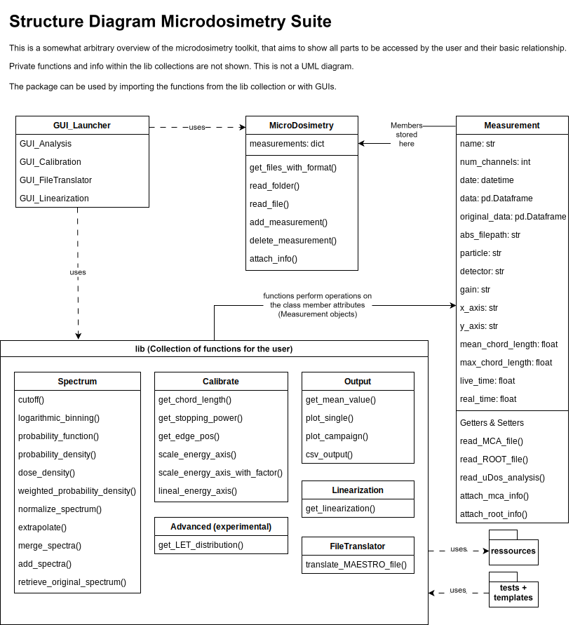

### MicroDosimetry Package
This is an analysis toolkit for evaluating microdosimetric data (pulse-height-spectra & Geant4/GATE simulation data). It can be either used like a Python package by importing its functions into your own code or with some GUIs.

Currently, only ORTEC MAESTRO .Spe files and simulation ROOT files are supported, but other read functions can be easily implemented. This is a work in progress and in its early stages. Theres still a lot missing, its a complete mess and very unstable ...

# Structure

**Current implementation**
 - MicroDosimetry.py: Containing the main classes MicroDosimetry and Measurement of this package. MicroDosimetry deals with reading the data, while Measurement is the blueprint for the data structure of a single spectrum.
 - GUI_Launcher.py: For launching the GUIs of the package


 - `/lib`: Containing collections of methods and tools to interact with the spectra
    - Linearization.py: For creating linearization curves for the spectra from calibration data (Gain + Electronics)
    - FileTranslator.py: For converting the original spectrum files into the package format .MCA (By attaching a linearization + Information)
    - Calibrate.py: For operations concerning the energy axis calibration
    - Spectrum.py: For different operations on the spectra (x and y axis)
    - Output.py: Some simple output functions for visualizing and storing the data for later analysis

 - `/guis`: Containing some simple GUIs for visualizing the data
    - GUI_Analysis.py: Single spectrum analysis for a quick preview of some data
    - GUI_Calibration.py: Performing an edge calibration using a spectrum
    - GUI_Linearization.py: Creating a linearization curve from calibration data
    - GUI_FileTranslator.py: Converting spectrum files into the package format .MCA (Attaching linearization)

 - `/tests`: Containing a collection of testfiles and testdata for checking the functionality of the package

- `/templates`: Containing some templates demonstrating the potential use of the toolkit, to ease the start for the user

    

# How to use this?

The package is designed to be used in a python environment. The user can either use the provided GUIs or import the functions into their own code. The GUIs are a practical way to quickly visualize data. The real power is in using the functions in your own code. Theres no magic happening, its basic operations on dataframes, the idea is to provide a structured way to do this and save the user time in writing the same code over and over.<br>

1. Your analysis folder does not have to be in the same directory as the package, just be sure to import it correctly.
2. Set up a python script and import the necessary parts:<br>
    ```
        from MicroDosimetry import MicroDosimetry

        from lib import Calibrate, Spectrum, Output
        from lib import FileTranslator, Linearization
    ```

    If you want to read in data, you have to include `MicroDosimetry`. The other parts are optional and can be imported as needed.

3. Make sure your data is already stored in the correct format. This means as an .MCA file with a linearization and some basic information attached. If not, use the `FileTranslator.py` to convert it. This step can be skipped for simulation data, it already is "calibrated"

4. An analysis can now be started by creating a MicroDosimetry object, e.g. `campaign1 = MicroDosimetry()`

5. Data can be read in using the read functions. There are two possibilities:
    - the `read_folder` method: `campaign1.read_folder('yourfolder/')`
    - the `read_file` method: `campaign1.read_file('yourfolder/yourfile.MCA')`

    This fills the `measurements` dictionary associated with one campaign (attribute of the MicroDosimetry object) with `Measurement` objects, each containing one spectrum and the associated metainformation.<br>

    The user can now access this information via the filename of the datafile: `campaign1.measurements['yourfile']`. The data itself is stored as a pandas dataframe in `campaign1.measurements['testfile'].data`. The other attributes can be accessed similarly.<br>

6. Operations can now performed on the Measurement objects. The content changes when the function is called, e.g: ``Spectrum.cutoff(campaign1.measurements['testfile'], channels=100)``.

    With some exceptions these functions have no return values. The general structure of a Measurement object does not change throughout, just the information attached. The original pulse height spectrum can always be retained, as it is stored in `campaign1.measurements['testfile'].original_data`.

7. The analysis can be perform in whichever way the user pleases. Impossible operations result in an error message. The order of the manipulations is arbitrary within certain bounds: Have a look onto the workflow attached to get a feel for the operation.<br>

    A plot or csv output of the data is possible at any step. For the Calibration and Linearization functions, it is also possible to view plots for verification.

The idea behind this toolkit is to allow for a comprehensible analysis of microdosimetric data. The user can easily access the data and perform operations on it. The data is stored in a structured way and that be easily accessed. The user can write python scripts to analyze several measurement campaigns, simulations or datasets in a structured way. The output can be stored and further processed elsewhere.<br>

In the end, maybe just have a look at the test scripts and templates and the comments in the source code. This toolkit is to be continuosly extended should the need for new methods arise. Critique and input is very welcome...

# Basic Workflow

The basic workflow from a measured pulse height spectrum to a microdosimetric yd(y) depiction:

#### 1. Attach a Linearization

The idea is to know which ADC channel corresponds to which pulse height. This way, you can compare different spectra taken with different readout chains with each other, the gain and electronic nonlinearities are included and considered in the analysis.

This can be measured with a pulser on the Amplifier Test input. Send in pulses with a steep flank (preferably sawtooth) of a known voltage (calibrated pulser). From the resulting spectrum, create the CHANNEL to mV correspondence using ``Linearization.get_linearization()``. This saves a calibration file (.csv) which can then be attached to the spectra in a .MCA file.

#### 2. Calibrate the Energy Axis

This is implemented as edge calibration (
https://doi.org/10.1063/1.4812920
). First you have to record a spectrum containing a particle edge. Attach the linearization to this spectrum and then use ``Calibrate.get_edge_pos()`` to fit a sigmoid to it and return the mV value. The (lineal) energy value is calculated as the maximum energy transfer from stopping power tables and detektor information with ``Calibrate.get_stopping_power()``. Now you can scale the energy axis of the spectrum with ``Calibrate.scale_energy_axis()``. If you happen to know the calibration already you can also use ``Calibrate.scale_energy_axis_with_factor()``.

#### 3. Do some maths

Now you can calculate the right PDF from the calibrated spectrum.

# Overview of file types and naming convention

As it might be a bit confusing for new users, here's an overview of the file types to be used with the toolkit

* Original spectrum data:
  * .Spe (MAESTRO files)
    ASCII int for all channels
  * .root (GATE/Geant4 output)
    Has to contain a `Hits/edep` tree
* Spectrum files for the analysis:
  * .MCA (Created from MAESTRO files or similar)
    Contain the linearization of a given measurement
    Can be created using the `FileTranslator`
  * .root
    Can be processed without any conversion
* Linearization & Calibration data:
  * Linearization files (.csv)
    Output from the `get_linearization `function
    Contain fitted data mV -> Channel for a measurement setup
    Either 1 or 3 columns (for different gains)
  * Linearization spectra (.Spe)
    Measured Peak positions for the linearization (MAESTRO .Spe or similar)
    Input for the `get_linearization_function`
  * Pulser calibration (.csv)
    Output calibration of the pulser used for the linearization: Goal vs Actual + Uncertainty
    Input for the `get_linearization_function`
    Default is perfect 1:1 response
* Internal data (ressources)
  * Stopping power tables (.csv)
    Used by the calibration methods